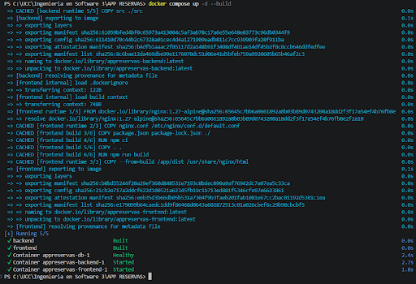
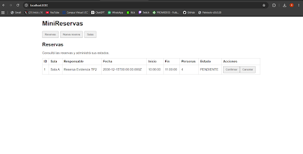
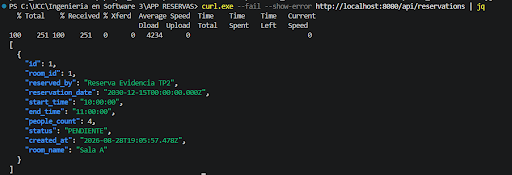
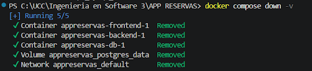
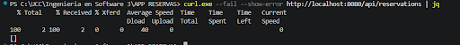
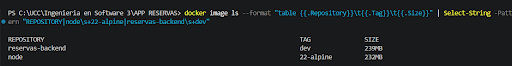
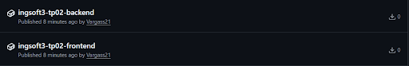

1) Primera captura muestra el error de haber creado la regla para no poder pushear cosas al main

2) Esta imagen muestra el error de que no se puede realizar el merge 

3) Aca se muestra el conflicto, y hay que resolverlo para que se pueda mergear

4) Esta última imagen muestra la primera versión publicada.

## TP2 — Contenedores

### 1. Compose / end-to-end

Se levantó la aplicación completa utilizando:

`docker compose up -d --build`

El frontend, backend y PostgreSQL quedaron funcionando conjuntamente mediante Docker Compose.

Esta captura demuestra el funcionamiento end-to-end de la aplicación.

### 2. Persistencia

Se verificó la persistencia creando una reserva y posteriormente ejecutando `docker compose down`.

Luego, al volver a levantar la aplicación, se comprobó que la reserva no se había borrado, demostrando que el volumen conservó los datos.

`docker compose down` elimina los contenedores y la red del proyecto, pero no elimina el volumen nombrado de PostgreSQL. Por este motivo la reserva permaneció almacenada.

Al ejecutar `docker compose down -v` se eliminó también el volumen de PostgreSQL.

Después de levantar nuevamente el sistema, las reservas creadas manualmente habían desaparecido.

- El volumen anterior fue eliminado.
- PostgreSQL creó un volumen nuevo.
- Volvió a ejecutarse `001_init.sql`.
- Las reservas creadas manualmente desaparecieron.
- Los datos iniciales de la aplicación fueron recreados.

### 3. Comparación de imágenes

Node no tiene una separación SDK/runtime como .NET. La imagen final no necesariamente será menor que su imagen base.

El multi-stage utilizado en este proyecto evita incluir:

- devDependencies;
- tests;
- secretos;
- node_modules locales.

Además, separa la preparación de dependencias del runtime.

No se afirma una reducción respecto de `node:22-alpine`, ya que los valores reales de la captura no la muestran.

### 4. Registry

Las imágenes de backend y frontend fueron publicadas en GitHub Container Registry (GHCR) utilizando el tag SemVer `v0.1.0`.

Las imágenes publicadas son:

`ghcr.io/vargass21/ingsoft3-tp02-backend:v0.1.0`

`ghcr.io/vargass21/ingsoft3-tp02-frontend:v0.1.0`

Ambos paquetes fueron configurados como públicos.

Estas imágenes son utilizadas por `docker-compose.registry.yml` mediante la propiedad `image:` en lugar de `build:` para backend y frontend.

