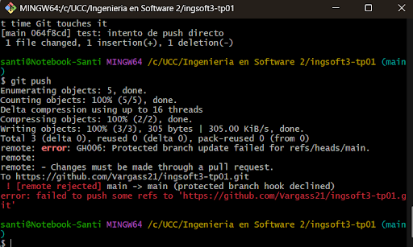
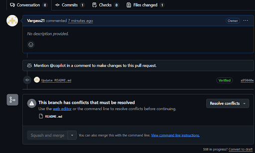
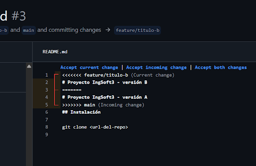
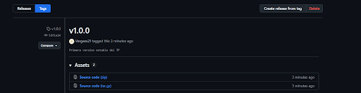

1) Primera captura muestra el error de haber creado la regla para no poder pushear cosas al main

2) Esta imagen muestra el error de que no se puede realizar el merge 

3) Aca se muestra el conflicto, y hay que resolverlo para que se pueda mergear

4) Esta última imagen muestra la primera versión publicada.

